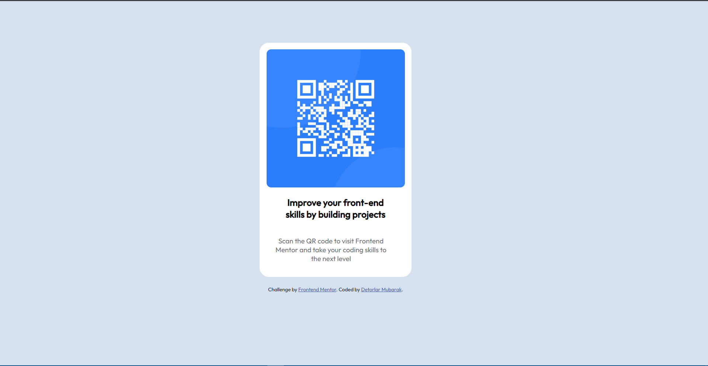

# Frontend Mentor - QR code component solution

This is a solution to the [QR code component challenge on Frontend Mentor](https://www.frontendmentor.io/challenges/qr-code-component-iux_sIO_H). Frontend Mentor challenges help you improve your coding skills by building realistic projects. 

## Overview

### Screenshot

## Author

- Website - [Github](https://github.com/Pious-coder)
- Frontend Mentor - [@pious-coder](https://www.frontendmentor.io/profile/pious-coder)
- Twitter - [@pious_coder](https://www.twitter.com/pious_coder)
